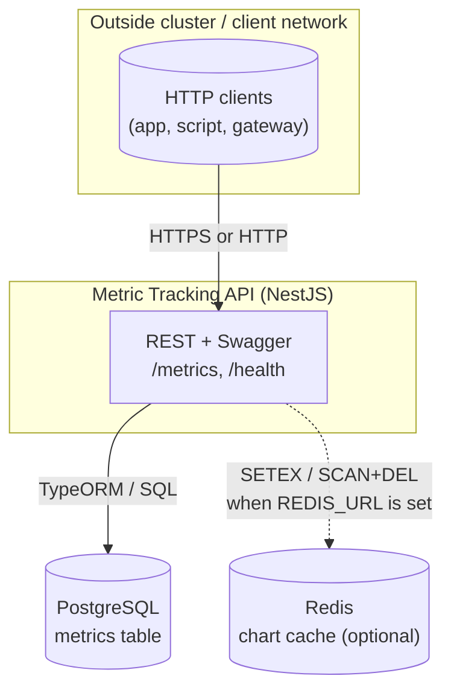
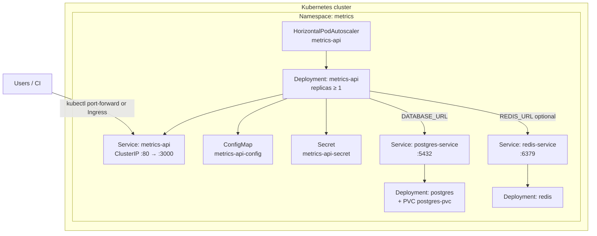
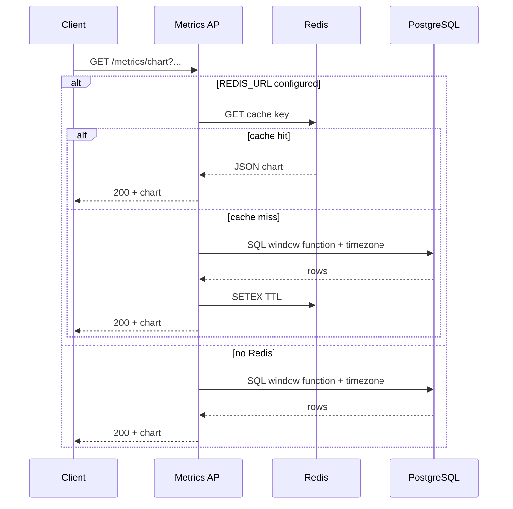
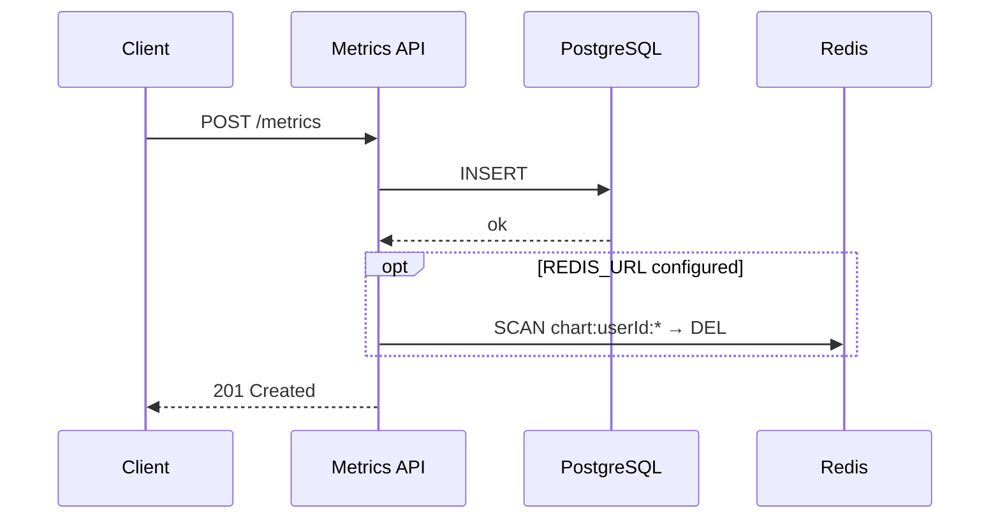
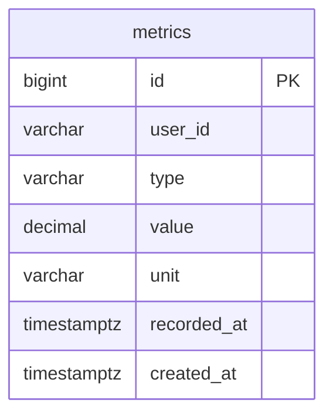

# Metric Tracking API — System design & deployment

This document describes the **overall design**, **key technical details**, and **trade-offs / assumptions** of the NestJS service for Distance and Temperature metrics (PostgreSQL, TypeORM).

## Quick start (local, without Kubernetes)

1. Run **PostgreSQL** (optional **Redis** for chart cache). Set `DATABASE_URL` in `.env` (see `k8s/postgres.yaml` / `k8s/secret.example.yaml` for example credentials).
2. `cp .env.example .env` — adjust variables.
3. `npm install` && `npm run start:dev`
4. **Swagger:** `http://localhost:3000/api` · **Health:** `GET /health` → `200` + `{ "status": "ok" }` (no DB check).
5. First-time DB: if `TYPEORM_MIGRATIONS_RUN` is not enabled, run `npm run migration:run`.

**Environment (minimal):**

| Variable | Notes |
|----------|--------|
| `DATABASE_URL` | PostgreSQL connection string (required to run the app) |
| `REDIS_URL` | Optional — enables cache for `GET /metrics/chart` |
| `TYPEORM_SYNC` | `true` only for dev; prefer migrations in production |
| `TYPEORM_MIGRATIONS_RUN` | `true` runs migrations on app boot (e.g. E2E) |
| `PORT` | Default `3000` |

**Tests:** `npm test` · E2E: `export DATABASE_URL=...` then `npm run test:e2e`.

---

## Architecture overview

### Logical diagram (client → API → persistence)

Primary data flow: clients call REST; the API reads/writes PostgreSQL; Redis participates only when chart endpoint caching is enabled.

### Kubernetes deployment diagram (namespace `metrics`)

Default manifests under `k8s/`: Kustomize bundles namespace, PostgreSQL (PVC), Redis, API ConfigMap/Secret, Deployment + Service, and HPA. Apply `metrics-api-secret` separately (not included in Kustomize).

**Deployment note:** In production you may replace in-cluster PostgreSQL/Redis with managed services; then remove the corresponding entries from `kustomization.yaml` and adjust the API Secret plus (if needed) `initContainers` in `deployment.yaml`. For cluster apply: `cp k8s/secret.example.yaml k8s/secret.yaml`, edit, `kubectl apply -f k8s/secret.yaml`, then `kubectl apply -k k8s/`. Access: `kubectl port-forward -n metrics svc/metrics-api 8080:80` → Swagger at `http://localhost:8080/api`. Image: `docker build -t metrics-api:latest .` (with minikube: `eval $(minikube docker-env)` before build). HPA needs Metrics Server; to disable autoscale for labs, remove `hpa.yaml` from `k8s/kustomization.yaml`.

### Chart read flow with Redis cache (optional)

### Write metric and cache invalidation flow

---

## System components

| Component | Role | Deployment notes |
|-----------|------|------------------|
| **HTTP API (NestJS)** | REST: create metric, keyset list, chart by local calendar day + timezone; health for probes; Swagger at `/api`. | Docker image `metrics-api`; container port **3000**; cluster Service **80→3000**. |
| **PostgreSQL** | Source of truth: `metrics` table, indexes for keyset and chart queries. | In K8s: Deployment `postgres`, Service `postgres-service:5432`, PVC `postgres-pvc`; Secret `postgres-secret`. Can be swapped for RDS/Cloud SQL. |
| **Redis** | Cache-aside for `GET /metrics/chart`; invalidation by prefix `chart:{userId}:*` after POST. | In K8s: Deployment `redis`, Service `redis-service:6379`. **Optional** — omit `REDIS_URL` and the API skips caching. |
| **Kubernetes** | Schedules Pods, Services, Secrets, ConfigMaps; HPA scales `metrics-api` on CPU/memory (requires Metrics Server). | `kubectl apply -k k8s/`; namespace `metrics`. [`k8s/hpa.yaml`](k8s/hpa.yaml): min 1, max 10 replicas. |
| **ConfigMap / Secret (API)** | Non-sensitive env vs `DATABASE_URL`, `REDIS_URL`, etc. | `metrics-api-config` + `metrics-api-secret` (from `secret.example.yaml`). |
| **Client / Gateway** | Calls the API; an API gateway or BFF may sit in front (auth is out of scope for this repo). | Port-forward: `kubectl port-forward -n metrics svc/metrics-api 8080:80`. |

**Main application dependencies:** NestJS, TypeORM, `pg` driver, Redis client (see `package.json`), validation & Swagger.

**TypeORM CLI:** `npm run migration:run` · `npm run migration:show` · `npm run migration:revert` — DataSource: `src/database/data-source.ts`.

---

## 1. System design

### 1.1. Context

- **Client** (app, script, gateway) uses HTTP REST.
- **API** handles validation, unit conversion, pagination, chart queries.
- **PostgreSQL** is the source of truth for all metric rows.
- **Redis** (optional) provides cache-aside for the chart endpoint, reducing DB read load for identical query parameters.

Default deployment path in this repo: **Kubernetes** (namespace `metrics`) with PostgreSQL and Redis in-cluster, or managed services outside the cluster; **HPA** (`k8s/hpa.yaml`) scales the API Deployment on CPU/memory when Metrics Server is available.

### 1.2. Application layering

| Layer | Role |
|-------|------|
| **Controller** (`MetricsController`) | HTTP routing, query/body DTOs, Swagger tags. |
| **Service** (`MetricsService`) | Business flow: cursor, timezone, cache key, invalidation after writes. |
| **Repository** (`MetricsTypeOrmRepository`) | TypeORM `QueryBuilder` (list), `DataSource.query` (raw SQL with window functions). |
| **Domain** (`common/utils.ts`, `common/constants.ts`, `common/type.ts`) | Units, Distance/Temperature conversion rules (Nest-agnostic helpers). |
| **Persistence** (`Metric` entity + migration) | `metrics` table, keyset-friendly indexes. |

### 1.3. Data model

Entity `Metric` maps to PostgreSQL table **`metrics`** (`src/metrics/entities/metric.entity.ts`).

- **Column details:** `user_id` and `unit`/`type` lengths match the entity (`varchar(255)` / `varchar(32)`); `value` is `decimal(30,10)` in the database.
- **Index** `IDX_metrics_user_type_recorded_id` on `(user_id, type, recorded_at, id)` supports list queries ordered by time descending with `id` as tie-breaker.
- Numeric values are stored as **decimal** in the DB and mapped to `string` in the TypeORM entity to avoid precision loss on some float parse paths.

### 1.4. API behavior (design level)

- **POST `/metrics`:** creates a row; after persist **invalidates** all chart cache for that `userId` when Redis is enabled.
- **GET `/metrics`:** filters by `userId`, `type`; **keyset pagination**; optional `targetUnit` for converted values in the response.
- **GET `/metrics/chart`:** time series with **one point per local calendar day** (IANA `timeZone`) — the **latest record within that day**; window `1m` / `2m`; Redis TTL 120s when caching is on.

**API summary**

- **POST `/metrics`** — Body: `userId`, `type` (`Distance` \| `Temperature`), `value`, `unit`, `recordedAt` (ISO-8601). Distance units: `m`, `cm`, `inch`, `ft`, `yard`. Temperature: `C`, `F`, `K`.
- **GET `/metrics`** — Query: `userId`, `type`, optional `limit` (max 100), `cursor`, `targetUnit`. Response: `{ items, nextCursor }`.
- **GET `/metrics/chart`** — Query: `userId`, `type`, `period` (`1m` \| `2m`), `timeZone` (IANA); optional `endDate` (`YYYY-MM-DD` in that timezone), `targetUnit`. Response: one point per local day (latest record that day).

---

## 2. Key implementation details

### 2.1. Keyset pagination

- Cursor is **base64url** encoding of JSON `{ t: recordedAt ISO string, i: id }`.
- Query fetches `limit + 1` rows, ordered `recorded_at DESC`, `id DESC`.
- Next page: tuple `(recorded_at, id)` is **less than** the cursor tuple (PostgreSQL), stable when many rows share the same `recorded_at`.
- `limit` is **clamped** to a maximum of 100.

### 2.2. Chart: “latest per local calendar day”

- SQL uses **CTEs** `bounds` / `span` to compute `end_local` (from `endDate` or “today” via `now() AT TIME ZONE tz`) and `start_local` going back `1 month` or `2 months`.
- **Ranking:** `ROW_NUMBER() OVER (PARTITION BY user_id, type, local_date ORDER BY recorded_at DESC, id DESC)` with `local_date = (recorded_at AT TIME ZONE $tz)::date`.
- Keep only `rn = 1`, order `local_date ASC`.
- Because window functions and timezone expressions are required, the repository uses **`DataSource.query`** instead of QueryBuilder alone.

### 2.3. Chart response date formatting

- The PostgreSQL driver may return `date` as a `Date` at **process-local midnight**; the service uses **`getFullYear` / `getMonth` / `getDate`** instead of `toISOString()` to avoid off-by-one days when the host is not UTC.

### 2.4. Unit conversion

- **Distance:** intermediate reference is **meters** (`TO_METERS`).
- **Temperature:** normalize via **Celsius**, then to target unit.
- Round to **6 decimal places** after conversion.
- Unit validation in DTO + service (`unitBelongsToType`).

### 2.5. Redis (chart)

- **Provider** token `REDIS_CLIENT` (`src/common/constants.ts`): if `REDIS_URL` is empty → `null`, service skips cache.
- Key: `chart:{userId}:{type}:{period}:{timeZone}:{endDate|__auto__}:{targetUnit|__raw__}`.
- **SETEX** with `CHART_CACHE_TTL_SEC` (default 120s in `src/common/constants.ts`); Redis errors are **swallowed** (fallback to DB).
- **Invalidation** after `create`: `SCAN` prefix `chart:{userId}:*` then `DEL` (batched).

### 2.6. TypeORM & migrations

- `TYPEORM_SYNC=true` is for dev only; production should use **migrations** (`CreateMetrics1743000000000`).
- Optionally `TYPEORM_MIGRATIONS_RUN=true` on boot (e.g. E2E) or run `npm run migration:run`.

### 2.7. Health

- `GET /health` returns **200** and `{ status: 'ok' }`, **without** hitting the database — suitable for liveness/readiness when only process liveness matters (add separate DB checks if required).

### 2.8. Validation & API contract

- Global `ValidationPipe`: `whitelist`, `transform`, `enableImplicitConversion`.
- Swagger at `/api`.

---

## 3. Trade-offs and assumptions

### 3.1. Trade-offs

| Decision | Benefits | Drawbacks / risks |
|----------|----------|-------------------|
| **Keyset vs offset** | Stable, efficient at large scale; no “page drift” on inserts. | No “jump to page N”; client must keep the cursor. |
| **Raw SQL for chart** | Clear timezone + window-function query, full control. | Weaker portability to other DBs; some domain intent lives in SQL. |
| **Store `value` as decimal → string in entity** | Fewer rounding issues on TypeORM round-trip. | Layers must `Number()` for math; needs discipline. |
| **Redis cache for chart only** | Offloads the heaviest read; invalidation scoped by user. | TTL 120s: chart can be **stale** up to ~2 minutes unless POST clears cache. |
| **Invalidate chart via SCAN** | No fixed key enumeration. | SCAN can be slow with very large keyspaces; at scale consider streams, tagged keys, or shorter TTL. |
| **`userId` is free-form string** | Flexible integration (UUID, internal ids). | No auth in scope — any client knowing `userId` can read/write via the API as implemented. |

### 3.2. Assumptions

1. **Single PostgreSQL** is enough for the use case; no sharding or read replicas in code.
2. Client **`recordedAt`** is valid ISO-8601; chart “local day” semantics depend on a valid **IANA timezone** (`Intl.DateTimeFormat` validation).
3. **No idempotency key** on POST — duplicate calls may create duplicate rows.
4. **Two metric types** are fixed (Distance, Temperature); new types need domain + migration/constraints if tightened.
5. **E2E** assumes a real PostgreSQL and `DATABASE_URL`; migrations may run on test boot.
6. **Redis is optional** — behavior must remain correct without `REDIS_URL`.

### 3.3. Intentionally out of scope (default)

- No message queue (Kafka, etc.), full distributed tracing, or rate limiting.
- AuthN/AuthZ not in this repo — use a BFF or API gateway if needed.

---

## 4. Source reference

| Topic | Location |
|-------|----------|
| Service (cursor, chart, cache) | `src/metrics/metrics.service.ts` |
| Repository (keyset + chart SQL) | `src/metrics/metrics-typeorm.repository.ts` |
| Entity & index | `src/metrics/entities/metric.entity.ts` |
| Migration | `src/database/migrations/1743000000000-CreateMetrics.ts` |
| Domain: units, `convertValue`, cursor, timezone, chart dates | `src/common/utils.ts` |
| Redis provider | `src/metrics/metrics.module.ts` |
| TypeORM configuration | `src/app.module.ts`, `src/database/typeorm-options.ts` |
