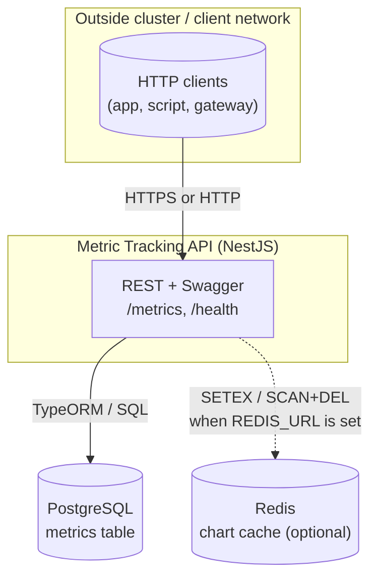
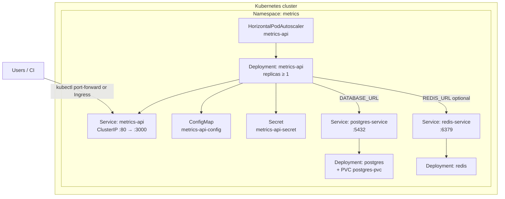
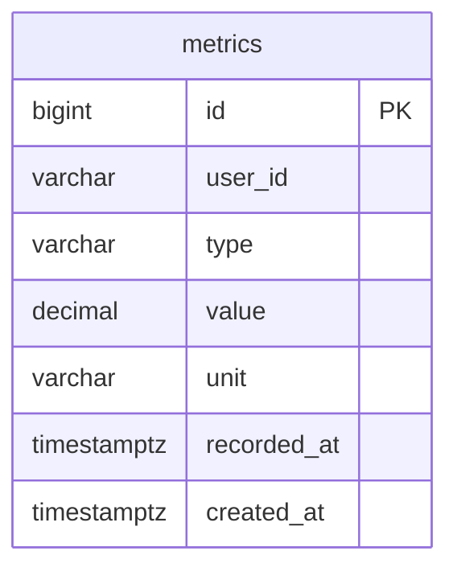
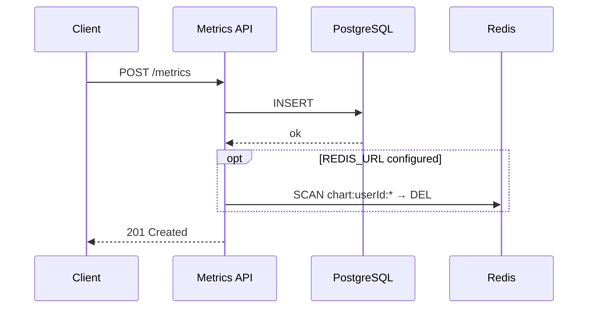
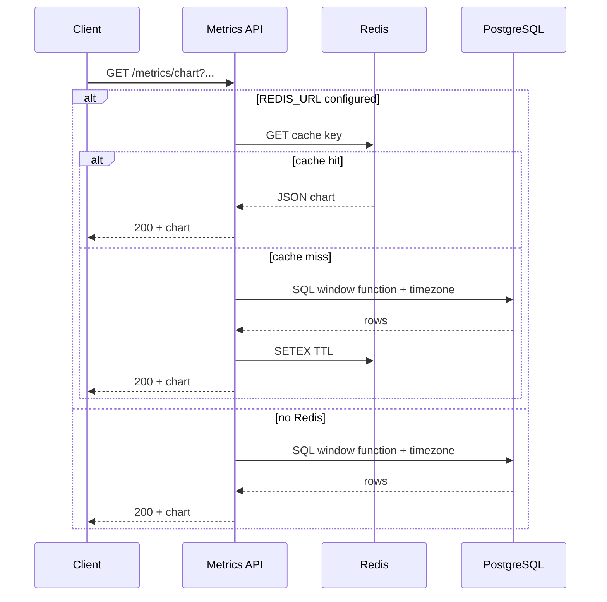

# Metric Tracking API — System design & deployment

This document describes the **overall design**, **key technical details**, and **trade-offs / assumptions** of the NestJS service for Distance and Temperature metrics (PostgreSQL, TypeORM).

## 1. System design

### 1.1. Architecture overview

- **Client** (app, script, gateway) uses HTTP REST.
- **API** handles validation, unit conversion, pagination, chart queries.
- **PostgreSQL** is the source of truth for all metric rows.
- **Redis** (optional) provides cache-aside for the chart endpoint, reducing DB read load for identical query parameters.
- 





Default deployment path in this repo: **Kubernetes** (namespace `metrics`) with PostgreSQL and Redis in-cluster, or managed services outside the cluster; **HPA** (`k8s/hpa.yaml`) scales the API Deployment on CPU/memory when Metrics Server is available.

Default manifests under `k8s/`: Kustomize bundles namespace, PostgreSQL (PVC), Redis, API ConfigMap/Secret, Deployment + Service, and HPA. Apply `metrics-api-secret` separately (not included in Kustomize).




### 1.2. Application layering

| Layer | Role |
|-------|------|
| **Controller** (`MetricsController`) | HTTP routing, query/body DTOs, Swagger tags. |
| **Service** (`MetricsService`) | Business flow: cursor, timezone, cache key, invalidation after writes. |
| **Repository** (`MetricsTypeOrmRepository`) | TypeORM `QueryBuilder` (list), `DataSource.query` (raw SQL with window functions). |
| **Domain** (`common/utils.ts`, `common/constants.ts`, `common/type.ts`) | Units, Distance/Temperature conversion rules (Nest-agnostic helpers). |
| **Persistence** (`Metric` entity + migration) | `metrics` table, keyset-friendly indexes. |

### 1.3. Data model

Entity `Metric` maps to PostgreSQL table **`metrics`** (`src/metrics/entities/metric.entity.ts`).



- **Column details:** `user_id` and `unit`/`type` lengths match the entity (`varchar(255)` / `varchar(32)`); `value` is `decimal(30,10)` in the database.
- **Index** `IDX_metrics_user_type_recorded_id` on `(user_id, type, recorded_at, id)` supports list queries ordered by time descending with `id` as tie-breaker.
- Numeric values are stored as **decimal** in the DB and mapped to `string` in the TypeORM entity to avoid precision loss on some float parse paths.

### 1.4. API behavior (design level)

- **POST `/metrics`:** creates a row; after persist **invalidates** all chart cache for that `userId` when Redis is enabled.



- **GET `/metrics`:** filters by `userId`, `type`; **keyset pagination**; optional `targetUnit` for converted values in the response.
- **GET `/metrics/chart`:** time series with **one point per local calendar day** (IANA `timeZone`) — the **latest record within that day**; window `1m` / `2m`; Redis TTL 120s when caching is on.



**API summary**

- **POST `/metrics`** — Body: `userId`, `type` (`Distance` \| `Temperature`), `value`, `unit`, `recordedAt` (ISO-8601). Distance units: `m`, `cm`, `inch`, `ft`, `yard`. Temperature: `C`, `F`, `K`.
- **GET `/metrics`** — Query: `userId`, `type`, optional `limit` (max 100), `cursor`, `targetUnit`. Response: `{ items, nextCursor }`.
- **GET `/metrics/chart`** — Query: `userId`, `type`, `period` (`1m` \| `2m`), `timeZone` (IANA); optional `endDate` (`YYYY-MM-DD` in that timezone), `targetUnit`. Response: one point per local day (latest record that day).

---

## 2. Key Implementation Details

This section highlights the key technical decisions that directly impact performance, correctness, scalability, and maintainability of the system.

---

### 2.1. Index & Query Alignment (Core Performance)

A composite index is designed on:

```
(user_id, type, recorded_at, id)
```

This index is intentionally aligned with the primary read patterns:

* Filtering by `user_id` and `type`
* Sorting by `recorded_at DESC, id DESC`

**Impact:**

* Enables PostgreSQL to efficiently serve both listing and chart queries
* Avoids additional sorting and full table scans
* Improves query latency under large datasets

---

### 2.2. Keyset Pagination (Scalability Under Write Load)

Instead of offset-based pagination, the system uses keyset pagination with a cursor:

```
(recorded_at, id)
```

**Rationale:**

* Offset pagination degrades as data grows
* Offset is unstable under concurrent inserts

**Impact:**

* Consistent performance regardless of dataset size
* No pagination drift when new records are inserted
* Better suitability for high-write workloads

---

### 2.3. Timezone-safe Aggregation (Correctness)

Chart queries handle timezone explicitly using:

* `AT TIME ZONE` in PostgreSQL
* Window functions for aggregation

Data is grouped based on the user’s IANA timezone and aggregated by **local calendar day**.

**Additional safeguard:**

* Avoid using `toISOString()` for chart labels
* Use calendar-based date extraction to prevent UTC shifting issues

**Impact:**

* Ensures correct time-series aggregation across timezones
* Prevents subtle bugs in global systems
* Demonstrates production-grade handling of temporal data

---

### 2.4. Focused Caching Strategy

Redis is used to cache only **chart responses**, which represent the most expensive read path.

**Design decisions:**

* List endpoints are not cached to reduce complexity
* Cache key includes all query dimensions (user, type, timezone, etc.)
* TTL is applied for automatic expiration
* Cache invalidation is triggered after write operations

**Impact:**

* Significantly reduces database load for repeated queries
* Keeps cache logic simple and maintainable
* Achieves high performance with minimal overhead

---

### 2.5. Stateless API & Horizontal Scalability

The API is designed to be fully stateless:

* No in-memory session or shared state
* External dependencies: PostgreSQL and Redis

**Impact:**

* Enables horizontal scaling across multiple instances
* Works seamlessly behind a load balancer
* Simplifies deployment and scaling strategies

---

### 2.6. Kubernetes-ready Deployment (Scalability & Resilience)

The service is designed to be deployable in containerized environments such as Kubernetes.

**Key aspects:**

* Liveness probe via `/health` endpoint
* Horizontal Pod Autoscaler (HPA) based on CPU or request metrics

**Impact:**

* Self-healing: failed instances are automatically restarted
* Auto-scaling: adapts to traffic fluctuations
* Improves overall system availability and resilience

---

### 2.7. Optimized JSON Serialization (Runtime Performance)

For high-throughput endpoints, the system optimizes JSON serialization using **fast-json-stringify**.

**Design decisions:**

* Use **fast-json-stringify** to compile response schemas into optimized serialization functions
* Apply only to **performance-critical paths** (e.g. chart endpoints with repeated response shapes)

**Rationale:**

* Native `JSON.stringify` is dynamic and incurs overhead for large or frequent responses
* **fast-json-stringify** improves performance by generating specialized serializers

**Impact:**

* Reduces CPU overhead during serialization
* Improves response latency under high load
* Increases throughput for read-heavy endpoints

---

### 2.8. Testing Strategy & CI/CD Readiness (Reliability)

The system includes both **unit tests** and **end-to-end (E2E) tests**.

**Design:**

* Unit tests cover core business logic (validation, unit conversion, query behavior)
* E2E tests validate full request flows (API → database → response)
* Tests run in isolation with a dedicated test setup

**CI/CD readiness:**

* Test suite is designed to run automatically in CI pipelines
* Ensures regressions are detected before deployment

**Impact:**

* Improves reliability and confidence when making changes
* Enables safe refactoring and continuous delivery
* Reduces risk of breaking critical functionality

---

### 2.9. Layered Architecture (Maintainability & Separation of Concerns)

The system follows an **n-layer (clean) architecture**:

* Controller layer handles HTTP concerns
* Service layer contains business logic
* Data layer manages persistence

**Design principles:**

* Clear separation of concerns
* Dependency flow from outer layers to inner layers
* Business logic is isolated from framework-specific details

**Impact:**

* Improves maintainability and readability
* Makes the system easier to extend and evolve
* Enhances testability (especially for unit tests)
* Reduces coupling between application logic and infrastructure

---

## 3. Trade-offs and Assumptions

This section outlines key trade-offs made to balance simplicity, performance, and scalability.

---

### 3.1. Key Trade-offs

**PostgreSQL instead of Time-series database (e.g. InfluxDB)**

* **Benefit:** Keeps the system simple with a single datastore, leveraging relational features (indexes, SQL, transactions)
* **Trade-off:** Lacks specialized time-series capabilities such as high-ingest optimization, retention policies, and built-in aggregations
* **Rationale:** PostgreSQL is sufficient for current scale; a time-series DB can be introduced when data volume or ingestion rate grows significantly

---

**Keyset pagination instead of offset**

* **Benefit:** Stable performance and no pagination drift under concurrent writes
* **Trade-off:** Does not support “jump to page N”; requires cursor-based navigation

---

**Raw SQL for chart queries**

* **Benefit:** Full control over timezone handling and window functions
* **Trade-off:** Reduced portability and some business logic resides in SQL

---

**Redis caching**

* **Benefit:** Reduces load on the most expensive read path with simple invalidation
* **Trade-off:** Data may be stale up to TTL (~120s), increase memory usage

---

**Cache invalidation via SCAN**

* **Benefit:** Flexible without maintaining explicit key mappings
* **Trade-off:** May become inefficient at large scale → alternative strategies (tag-based keys, streams, shorter TTL) may be needed

---

**Composite index vs Write-heavy ingestion**

* **Benefit:** Composite index aligned with read paths keeps list and chart queries efficient without extra moving parts for typical load.
* **Trade-off:** At very high ingestion rates, index maintenance can become a bottleneck; mitigations include batching writes, reducing indexes where safe, or moving to a time-series optimized database.

---

**Auto-scaling based on CPU utilization**

* **Benefit:** Simple to configure and widely supported (e.g. Kubernetes HPA)
* **Trade-off:** CPU may not accurately reflect real load, especially for I/O-bound workloads
* **Rationale:** Sufficient for current service; more advanced metrics (e.g. request rate, latency) can be introduced later

---

### 3.2. Assumptions

* A single PostgreSQL instance is sufficient for current scale
* Client provides valid ISO-8601 timestamps and IANA timezone
* No idempotency key is required for current use case
* Test environment uses a real PostgreSQL instance
* Redis is optional; system remains correct without caching

---

### 3.3. Further Improvements

As the system scales, the following enhancements can be considered:

* Database scaling: add read replicas, partitioning, or evaluate a time-series database for high ingestion workloads
* CQRS: separate read/write paths and precompute aggregations for chart queries
* Event-driven ingestion: use Kafka to handle high-throughput and decouple processing
* Observability: introduce distributed tracing to monitor and debug performance
* Scaling strategy: move beyond CPU-based auto scaling to request rate or latency metrics
---

## 4. Run projects

### Local (without Kubernetes)

1. Run **PostgreSQL** (optional **Redis** for chart cache). Set `DATABASE_URL` in `.env` (see `k8s/postgres.yaml` / `k8s/secret.example.yaml` for example credentials).
2. `cp .env.example .env` — adjust variables.
3. `npm install` && `npm run start:dev`
4. **Swagger:** `http://localhost:3000/api` · **Health:** `GET /health` → `200` + `{ "status": "ok" }` (no DB check).
5. First-time DB: if `TYPEORM_MIGRATIONS_RUN` is not enabled, run `npm run migration:run`.

**Environment (minimal):**

| Variable | Notes |
|----------|--------|
| `DATABASE_URL` | PostgreSQL connection string (required to run the app) |
| `REDIS_URL` | Optional — enables cache for `GET /metrics/chart` |
| `TYPEORM_SYNC` | `true` only for dev; prefer migrations in production |
| `TYPEORM_MIGRATIONS_RUN` | `true` runs migrations on app boot (e.g. E2E) |
| `PORT` | Default `3000` |

**Tests:** `npm test` · E2E: `export DATABASE_URL=...` then `npm run test:e2e`.

### Kubernetes (k8s)

Manifests under `k8s/` use **Kustomize** (namespace, Postgres, Redis, API ConfigMap/Deployment/Service, HPA). The API **Secret** is applied separately.

1. Build image: `docker build -t metrics-api:latest .` (minikube: `eval $(minikube docker-env)` before build).
2. `cp k8s/secret.example.yaml k8s/secret.yaml`, edit values, then `kubectl apply -f k8s/secret.yaml`.
3. `kubectl apply -k k8s/`.
4. Access: `kubectl port-forward -n metrics svc/metrics-api 8080:80` → Swagger at `http://localhost:8080/api`.

**Notes:** HPA needs Metrics Server; to disable autoscaling locally, remove `hpa.yaml` from `k8s/kustomization.yaml`. In production you may use managed PostgreSQL/Redis — adjust Secret and manifests accordingly (see **Deployment note** under Architecture).

---
